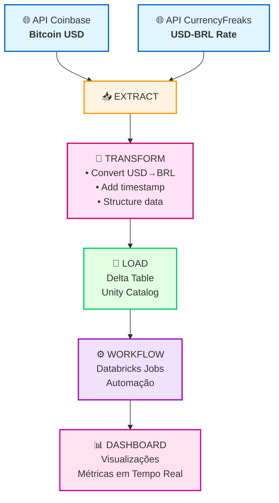
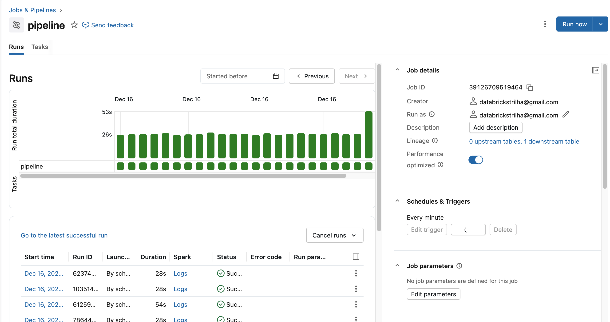
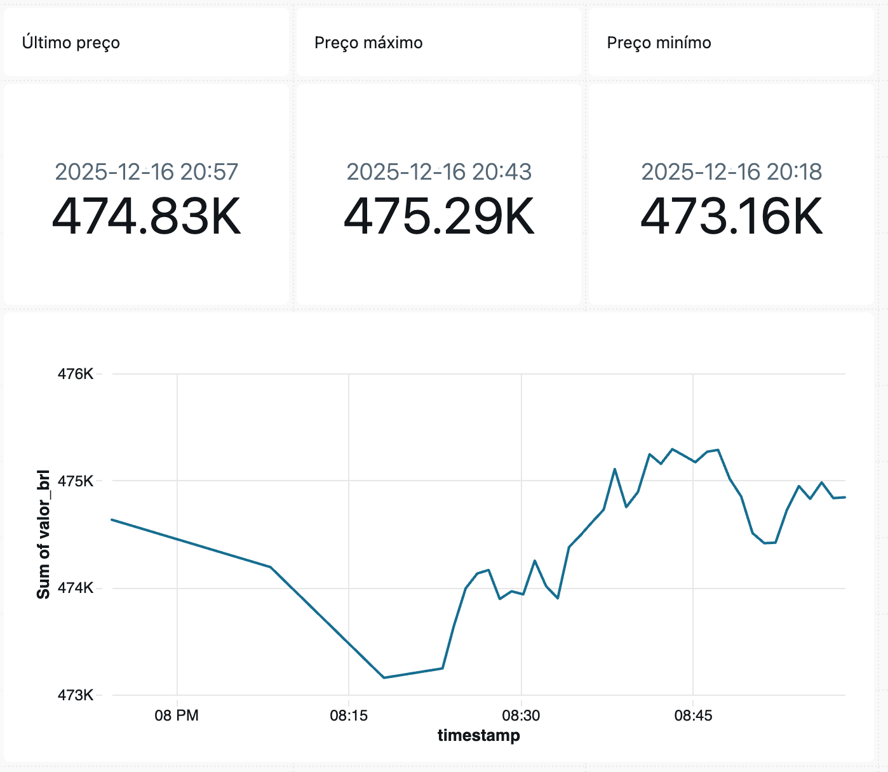

<p align="center">
  <a href="https://suajornadadedados.com.br/"></a>
</p>
<p align="center">
    <em>Nossa missão é fornecer o melhor ensino em engenharia de dados</em>
</p>

---

# 💰 **Data Pipeline: Extração de Dados Bitcoin com ETL em PySpark e Databricks**

## 📋 **Sobre o Projeto**

Este projeto faz parte de um **workshop gratuito de Data Engineering para Iniciantes**, realizado no dia **16/12/2025 às 19h30**, que pode ser assistido aqui: 

[](https://www.youtube.com/live/pFJCL1S3Zj8)

---

## 🎯 **O que vamos construir?**

Neste workshop, você vai construir um **pipeline ETL completo** que extrai dados de APIs, transforma e armazena em Delta Tables, e cria um dashboard interativo para visualização.

### **Arquitetura Completa do Projeto**



### **Componentes do Projeto:**

1. **📥 EXTRACT**: Extração de dados de 2 APIs (Coinbase e CurrencyFreaks)
2. **🔄 TRANSFORM**: Conversão de moedas e estruturação de dados
3. **💾 LOAD**: Armazenamento em Delta Table no Unity Catalog
4. **⚙️ WORKFLOW**: Automação via Databricks Jobs & Pipelines
5. **📊 DASHBOARD**: Visualização interativa com métricas e gráficos

---

## 🎓 **Objetivos da Aula**

### **Objetivo Geral**

Ensinar os **fundamentos práticos de Data Engineering** através da construção de um pipeline ETL completo, desde a extração de dados de APIs até a criação de dashboards interativos, utilizando tecnologias modernas e amplamente utilizadas no mercado.

### **Objetivos de Aprendizado**

#### **1. Fundamentos de Python para Data Engineering**
- ✅ **Variáveis e tipos de dados** (string, int, float, bool, list, dict)
- ✅ **Funções e métodos** (criação, reutilização, métodos de string/list/dict)
- ✅ **Manipulação de dados** (estruturas de dados, iterações)
- ✅ **Tratamento de APIs** (requisições HTTP, JSON, tratamento de erros)

**Por que é importante?** Python é a linguagem mais usada em Data Engineering. Dominar os fundamentos é essencial para construir pipelines robustos.

---

#### **2. Fundamentos de SQL para Análise de Dados**
- ✅ **SELECT, FROM, WHERE** (consultas básicas)
- ✅ **ORDER BY e LIMIT** (ordenação e limitação de resultados)
- ✅ **Alias (AS)** (renomeação de colunas)
- ✅ **Consultas analíticas** (último valor, máximo, mínimo, histórico)

**Por que é importante?** SQL é a linguagem padrão para consultar dados. Todo Data Engineer precisa saber SQL para criar dashboards, relatórios e análises.

---

#### **3. ETL (Extract, Transform, Load)**
- ✅ **Extract (Extração)**: Consumir dados de APIs REST
- ✅ **Transform (Transformação)**: Converter moedas, estruturar dados, adicionar metadados
- ✅ **Load (Carga)**: Armazenar dados em formatos otimizados (Delta Lake)

**Por que é importante?** ETL é o coração da Engenharia de Dados. 90% do trabalho de um Data Engineer é construir e manter pipelines ETL.

---

#### **4. PySpark e Processamento Distribuído**
- ✅ **DataFrames PySpark** (estrutura de dados distribuída)
- ✅ **Diferença entre Pandas e PySpark** (quando usar cada um)
- ✅ **Processamento em escala** (preparação para Big Data)

**Por que é importante?** PySpark permite processar terabytes de dados distribuídos em clusters. É essencial para projetos reais de Big Data.

---

#### **5. Databricks e Unity Catalog**
- ✅ **Workspace Databricks** (ambiente de desenvolvimento)
- ✅ **Unity Catalog** (governança de dados: Catalog → Schema → Table)
- ✅ **Notebooks interativos** (desenvolvimento e documentação)

**Por que é importante?** Databricks é uma das plataformas mais usadas no mercado. Unity Catalog é o padrão moderno para organização de dados em Data Lakes.

---

#### **6. Delta Lake e Armazenamento ACID**
- ✅ **Delta Tables** (tabelas com transações ACID)
- ✅ **Time Travel** (acesso a versões históricas)
- ✅ **Schema Evolution** (evolução automática do schema)
- ✅ **Append incremental** (histórico de dados)

**Por que é importante?** Delta Lake traz confiabilidade e performance para Data Lakes. É o padrão moderno para armazenamento de dados analíticos.

---

#### **7. Automação com Databricks Workflows**
- ✅ **Criação de workflows** (orquestração de pipelines)
- ✅ **Parâmetros Key-Value** (configuração dinâmica)
- ✅ **Execução agendada** (automação de coleta de dados)

**Por que é importante?** Pipelines precisam rodar automaticamente. Workflows permitem orquestrar e agendar execuções sem intervenção manual.

---

#### **8. Visualização e Dashboards**
- ✅ **Queries SQL para dashboards** (4 queries principais)
- ✅ **Visualização de dados** (gráficos, métricas, histórico)
- ✅ **Análise de tendências** (evolução temporal de preços)

**Por que é importante?** Dados sem visualização não geram valor. Dashboards permitem que stakeholders tomem decisões baseadas em dados.

---

### **Resultado Final da Aula**

Ao final do workshop, você terá construído:

1. ✅ **Pipeline ETL completo** funcionando em produção
2. ✅ **Conhecimento prático** de Python, SQL, PySpark e Databricks
3. ✅ **Portfólio real** para mostrar em entrevistas
4. ✅ **Base sólida** para avançar em Data Engineering

### **Pré-requisitos**

- ✅ Conhecimento básico de programação (qualquer linguagem)
- ✅ Acesso à internet
- ✅ Conta gratuita no Databricks (criaremos durante a aula)
- ✅ Vontade de aprender! 🚀

---

## 📊 **Esquema do Projeto**

Visualize a arquitetura completa do projeto: [app.excalidraw.com](https://app.excalidraw.com/s/8pvW6zbNUnD/9zZctm3OR9f)

---

## 🎯 **Overview do Projeto**

### **Objetivo Principal**  

Desenvolver um pipeline ETL automatizado para consumir dados da **API da Coinbase** (preço do Bitcoin em USD) e da **API CurrencyFreaks** (cotação USD-BRL), transformar os dados convertendo o valor para Real Brasileiro, e armazenar em **Delta Tables** no Databricks usando **Unity Catalog**.

---

## 📦 **Requisitos do Projeto**

### **Requisitos Funcionais**

1. **Extração de Dados**
   - Extrair preço atual do Bitcoin em USD da API Coinbase
   - Extrair cotação USD-BRL da API CurrencyFreaks
   - Tratamento de erros e retry logic

2. **Transformação de Dados**
   - Converter valor de USD para BRL usando cotação em tempo real
   - Adicionar timestamp de processamento
   - Estruturar dados em formato tabular

3. **Carga de Dados**
   - Armazenar dados em Delta Table no Unity Catalog
   - Suportar append incremental (histórico de preços)
   - Garantir schema evolution automático

4. **Automação**
   - Pipeline executável via Databricks Workflows
   - Configuração de parâmetros via Key-Value pairs
   - Execução agendada ou manual

### **Requisitos Técnicos**

- **Python 3.8+**
- **Databricks Workspace** (conta gratuita disponível)
- **APIs Externas:**
  - Coinbase API (pública, sem autenticação)
  - CurrencyFreaks API (requer API key)
- **Bibliotecas Python:**
  - `requests` - Para requisições HTTP
  - `pyspark` - Para processamento distribuído (disponível no Databricks)
  - `datetime` - Para manipulação de timestamps

### **Requisitos de Infraestrutura**

- **Databricks Workspace** configurado
- **Unity Catalog** habilitado
- **Cluster Databricks** ou **SQL Warehouse** para execução
- **API Key CurrencyFreaks** configurada no pipeline

---

## 🔄 **Arquitetura ETL**

### **1. EXTRACT (Extração)**

#### **O que será extraído:**

**a) Dados do Bitcoin (API Coinbase)**
- **Fonte:** `https://api.coinbase.com/v2/prices/spot`
- **Dados extraídos:**
  - `amount`: Preço atual do Bitcoin em USD
  - `base`: Criptomoeda (BTC)
  - `currency`: Moeda de referência (USD)
- **Formato:** JSON
- **Frequência:** Tempo real (on-demand)

**b) Cotação USD-BRL (API CurrencyFreaks)**
- **Fonte:** `https://api.currencyfreaks.com/v2.0/rates/latest`
- **Dados extraídos:**
  - `rates.BRL`: Taxa de conversão USD para BRL
  - `date`: Data/hora da cotação
  - `base`: Moeda base (USD)
- **Formato:** JSON
- **Autenticação:** API Key (via parâmetros do pipeline)
- **Frequência:** Tempo real (on-demand)

#### **Funções de Extração:**

```python
def extrair_dados_bitcoin():
    """Extrai o JSON completo da API da Coinbase."""
    url = 'https://api.coinbase.com/v2/prices/spot'
    resposta = requests.get(url)
    return resposta.json()

def extrair_cotacao_usd_brl():
    """Extrai a cotação USD-BRL da API CurrencyFreaks."""
    api_key = dbutils.widgets.get("api_key")
    url = f'https://api.currencyfreaks.com/v2.0/rates/latest?apikey={api_key}'
    resposta = requests.get(url)
    return resposta.json()
```

---

### **2. TRANSFORM (Transformação)**

#### **O que será transformado:**

1. **Conversão de Moeda**
   - Multiplicar valor USD pela taxa de conversão USD-BRL
   - Calcular valor equivalente em Real Brasileiro

2. **Estruturação de Dados**
   - Selecionar campos relevantes
   - Renomear colunas para português
   - Adicionar timestamp de processamento

3. **Validação e Limpeza**
   - Converter tipos de dados (string → float)
   - Garantir formato correto do timestamp (datetime object)

#### **Schema Final dos Dados:**

| Coluna | Tipo | Descrição |
|--------|------|-----------|
| `valor_usd` | DOUBLE | Preço do Bitcoin em Dólar Americano |
| `valor_brl` | DOUBLE | Preço do Bitcoin em Real Brasileiro |
| `criptomoeda` | STRING | Nome da criptomoeda (BTC) |
| `moeda_original` | STRING | Moeda de referência original (USD) |
| `taxa_conversao_usd_brl` | DOUBLE | Taxa de conversão utilizada |
| `timestamp` | TIMESTAMP | Data e hora do processamento |

#### **Função de Transformação:**

```python
def tratar_dados_bitcoin(dados_json, taxa_usd_brl):
    """Transforma os dados brutos da API, renomeia colunas, 
    adiciona timestamp e converte para BRL."""
    valor_usd = float(dados_json['data']['amount'])
    criptomoeda = dados_json['data']['base']
    moeda_original = dados_json['data']['currency']
    
    # Convertendo de USD para BRL
    valor_brl = valor_usd * taxa_usd_brl
    
    # Adicionando timestamp como datetime object
    timestamp = datetime.now()
    
    dados_tratados = [{
        "valor_usd": valor_usd,
        "valor_brl": valor_brl,
        "criptomoeda": criptomoeda,
        "moeda_original": moeda_original,
        "taxa_conversao_usd_brl": taxa_usd_brl,
        "timestamp": timestamp
    }]
    
    return dados_tratados
```

---

### **3. LOAD (Carga)**

#### **Onde será carregado:**

**Delta Table no Unity Catalog**

- **Catalog:** `pipeline_api_bitcoin`
- **Schema:** `bitcoin_data`
- **Tabela:** `bitcoin_data`
- **Caminho completo:** `pipeline_api_bitcoin.bitcoin_data.bitcoin_data`

#### **Características do Armazenamento:**

1. **Formato:** Delta Lake
   - ACID transactions
   - Time Travel (acesso a versões históricas)
   - Schema Evolution automático
   - Otimizações automáticas

2. **Modo de Escrita:**
   - `append`: Adiciona novos registros sem sobrescrever
   - `mergeSchema`: Permite evolução do schema automaticamente

3. **Estrutura:**
   - Tabela criada automaticamente pelo `saveAsTable()`
   - Schema inferido do DataFrame PySpark
   - Timestamp como tipo TIMESTAMP (não string)

#### **Código de Carga:**

```python
# Criar Spark DataFrame
df = spark.createDataFrame(dados_bitcoin_tratado)

# Caminho da tabela Delta no Unity Catalog
delta_table_path = "pipeline_api_bitcoin.bitcoin_data.bitcoin_data"

# Salvar como Delta Table (modo append)
df.write \
    .format("delta") \
    .mode("append") \
    .option("mergeSchema", "true") \
    .saveAsTable(delta_table_path)
```

---

## 🔧 **Stack Tecnológico**

### **1. Python**
- **Versão:** 3.8+
- **Uso:** Linguagem principal do pipeline

### **2. Requests** (`requests`)
- **O que faz:** Biblioteca para fazer requisições HTTP
- **Por que usamos:** Para consumir as APIs da Coinbase e CurrencyFreaks
- **Versão:** Última estável

### **3. PySpark** (`pyspark`)
- **O que faz:** API Python para Apache Spark, framework de processamento distribuído
- **Por que usamos:** 
  - Processar dados de forma distribuída
  - Criar DataFrames estruturados
  - Salvar em Delta Tables
  - Preparado para escalar para grandes volumes
- **Disponibilidade:** Já incluído no Databricks

### **4. Databricks**
- **O que faz:** Plataforma unificada de análise de dados baseada em Spark
- **Por que usamos:**
  - Ambiente gerenciado para PySpark
  - Unity Catalog para governança de dados
  - Delta Lake nativo
  - Workflows para automação
  - Dashboards e visualizações
  - Agentes de IA integrados

### **5. Unity Catalog**
- **O que faz:** Sistema de governança de dados unificado no Databricks
- **Por que usamos:**
  - Organização hierárquica (Catalog → Schema → Table)
  - Controle de acesso centralizado
  - Linhagem de dados
  - Auditoria e compliance

### **6. Delta Lake**
- **O que faz:** Camada de armazenamento open-source para Data Lakes
- **Por que usamos:**
  - Transações ACID
  - Time Travel (acesso a versões históricas)
  - Schema Evolution automático
  - Performance otimizada
  - Baseado em Parquet (columnar)

---

## 📚 **Por Que Usar Databricks e PySpark?**

### **PySpark vs Pandas**

| Característica | Pandas | PySpark |
|----------------|--------|---------|
| **Escalabilidade** | Single machine (RAM limitada) | Distributed (clusters) |
| **Volume de Dados** | Megabytes a Gigabytes | Terabytes a Petabytes |
| **Processamento** | In-memory (RAM) | Distributed (disco + memória) |
| **Uso** | Análise exploratória, datasets pequenos | Big Data, pipelines de produção |

**Neste projeto:** Usamos PySpark porque:
- ✅ Preparado para escalar
- ✅ Integração nativa com Databricks
- ✅ Suporte a Delta Lake
- ✅ Processamento distribuído

### **Delta Lake vs Parquet Simples**

| Característica | Parquet | Delta Lake |
|----------------|---------|------------|
| **Transações ACID** | ❌ | ✅ |
| **Time Travel** | ❌ | ✅ |
| **Schema Evolution** | Manual | Automático |
| **Updates/Deletes** | ❌ | ✅ |
| **Performance** | Boa | Otimizada |

**Neste projeto:** Usamos Delta Lake porque:
- ✅ Histórico completo de preços (Time Travel)
- ✅ Garantias de consistência (ACID)
- ✅ Permite evoluir schema sem quebrar dados antigos
- ✅ Otimizações automáticas

---

## 🚀 **Como Usar**

### **Pré-requisitos**

- Conta no Databricks (gratuita para testes)
- API Key da CurrencyFreaks
- Cluster Databricks ou SQL Warehouse configurado
- Unity Catalog habilitado

### **Instalação**

1. **Clone o repositório:**
```bash
git clone https://github.com/seu-usuario/pipeline-api-bitcoin-com-databricks.git
cd pipeline-api-bitcoin-com-databricks
```

2. **Importe os notebooks no Databricks:**
   - Acesse seu workspace Databricks
   - Vá em **Workspace** → **Import**
   - Selecione os arquivos `.py` da pasta `src/`

### **Configuração do Pipeline**

1. **Criar Workflow no Databricks:**
   - Acesse **Workflows** → **Create**
   - Adicione uma task do tipo **Notebook**
   - Selecione o notebook `get_bitcoin_macro.py`

2. **Configurar Parâmetros (Key-Value):**
   - Na seção **Parameters** da task
   - Adicione:
     - **Key:** `api_key`
     - **Value:** `sua_api_key_aqui`

3. **Configurar Cluster:**
   - Selecione um cluster existente ou crie um novo
   - Recomendado: Single Node ou Small cluster para testes

4. **Executar Pipeline:**
   - Clique em **Run now** para execução manual
   - Ou configure um **Schedule** para execução automática

### **Verificar Dados**

Após a execução, os dados estarão disponíveis em:

```sql
SELECT * FROM pipeline_api_bitcoin.bitcoin_data.bitcoin_data
ORDER BY timestamp DESC
LIMIT 10;
```

---

## 📖 **Estrutura do Projeto**

```text
pipeline-api-bitcoin-com-databricks/
├── img/
│   └── SeUZPWKQ.png              # Imagem de capa do projeto
├── src/
│   ├── get_bitcoin_full.py       # Notebook completo com documentação
│   ├── get_bitcoin_macro.py      # Script para workflows (simplificado)
│   ├── aquecimento_python.py    # Tutorial de Python básico
│   └── aquecimento_sql.py       # Tutorial de SQL básico
├── README.md                     # Este arquivo
└── .gitignore                    # Arquivos ignorados pelo Git
```

### **Arquivos Principais**

- **`get_bitcoin_full.py`**: Notebook completo com explicações detalhadas, exemplos de salvamento em JSON/CSV/Parquet/Delta, e visualizações
- **`get_bitcoin_macro.py`**: Versão simplificada para uso em workflows, apenas salva em Delta Table
- **`aquecimento_python.py`**: Tutorial de Python básico (variáveis, print, métodos)
- **`aquecimento_sql.py`**: Tutorial de SQL básico (SELECT, WHERE, ORDER BY, LIMIT)

---

## 🔄 **Fluxo Completo do Pipeline**


---

## 📊 **Queries do Dashboard**

O dashboard utiliza **4 queries SQL** para exibir diferentes visualizações dos dados do Bitcoin. Todas as queries consultam a tabela Delta `pipeline_api_bitcoin.bitcoin_data.bitcoin_data`.

### **1. LAST PRICE — Último Preço Registrado**

Retorna o preço mais recente do Bitcoin e o timestamp da coleta.

```sql
SELECT
  valor_brl        AS last_price,
  timestamp        AS last_timestamp
FROM pipeline_api_bitcoin.bitcoin_data.bitcoin_data
WHERE criptomoeda = 'BTC'
ORDER BY timestamp DESC
LIMIT 1
```

**Uso no Dashboard:** Exibido como valor principal em BRL (card ou métrica).

---

### **2. MAX PRICE — Maior Preço Histórico**

Retorna o maior preço já registrado e quando ocorreu.

```sql
SELECT
  valor_brl  AS max_price,
  timestamp  AS max_timestamp
FROM pipeline_api_bitcoin.bitcoin_data.bitcoin_data
WHERE criptomoeda = 'BTC'
ORDER BY valor_brl DESC, timestamp DESC
LIMIT 1
```

**Uso no Dashboard:** Exibido como métrica de máximo histórico em BRL.

---

### **3. MIN PRICE — Menor Preço Histórico**

Retorna o menor preço já registrado e quando ocorreu.

```sql
SELECT
  valor_brl  AS min_price,
  timestamp  AS min_timestamp
FROM pipeline_api_bitcoin.bitcoin_data.bitcoin_data
WHERE criptomoeda = 'BTC'
ORDER BY valor_brl ASC, timestamp DESC
LIMIT 1
```

**Uso no Dashboard:** Exibido como métrica de mínimo histórico em BRL.

---

### **4. HISTÓRICO DE PREÇOS — Gráfico de Linha**

Retorna o histórico completo de preços ordenado por timestamp para visualização em gráfico.

```sql
SELECT
  timestamp,
  valor_usd,
  valor_brl,
  taxa_conversao_usd_brl
FROM pipeline_api_bitcoin.bitcoin_data.bitcoin_data
WHERE criptomoeda = 'BTC'
ORDER BY timestamp ASC
```

**Uso no Dashboard:** Exibido como gráfico de linha mostrando a evolução do preço ao longo do tempo.

**Variações possíveis:**
- Últimas N horas: `WHERE timestamp >= CURRENT_TIMESTAMP - INTERVAL '24' HOUR`
- Últimos N registros: `ORDER BY timestamp DESC LIMIT 100`
- Agregação por hora: `GROUP BY DATE_TRUNC('hour', timestamp)`

---

### **📋 Resumo das Queries**

| Query | Ordenação | Limite | Uso |
|-------|-----------|--------|-----|
| **LAST PRICE** | `ORDER BY timestamp DESC` | `LIMIT 1` | Card/Métrica principal (BRL) |
| **MAX PRICE** | `ORDER BY valor_brl DESC` | `LIMIT 1` | Métrica de máximo (BRL) |
| **MIN PRICE** | `ORDER BY valor_brl ASC` | `LIMIT 1` | Métrica de mínimo (BRL) |
| **HISTÓRICO** | `ORDER BY timestamp ASC` | Sem limite | Gráfico de linha |

**Todas as queries usam:**
- `WHERE criptomoeda = 'BTC'` (filtro)
- `AS` (alias para facilitar uso no dashboard)

---

## 📊 **Exemplo de Dados Gerados**

### **Estrutura da Tabela Delta:**

| valor_usd | valor_brl | criptomoeda | moeda_original | taxa_conversao_usd_brl | timestamp |
|-----------|-----------|-------------|---------------|------------------------|-----------|
| 43250.50 | 236125.48 | BTC | USD | 5.4567 | 2025-01-16 14:30:00 |
| 43280.25 | 236245.12 | BTC | USD | 5.4572 | 2025-01-16 14:31:00 |
| 43295.00 | 236310.15 | BTC | USD | 5.4575 | 2025-01-16 14:32:00 |

---

## 🎓 **Workshop**

Este projeto foi desenvolvido durante um workshop ao vivo. Assista a gravação completa:

🔗 [YouTube Live - Workshop Data Engineering](https://www.youtube.com/live/pFJCL1S3Zj8)

**Data:** 16/12/2025 às 19h30

---

## 🔐 **Segurança e Boas Práticas**

### **API Keys**

- ✅ **Nunca** commite API keys no código
- ✅ Use parâmetros do pipeline (Key-Value) ou Databricks Secrets
- ✅ Configure permissões adequadas no Unity Catalog

### **Governança de Dados**

- ✅ Use Unity Catalog para organização hierárquica
- ✅ Defina schemas claros e descritivos
- ✅ Documente tabelas e colunas
- ✅ Configure políticas de retenção de dados

---

## ⚙️ **Jobs & Pipelines - Orquestração do Pipeline**

Para automatizar a execução do nosso pipeline ETL, vamos criar um **Job** no Databricks que orquestra a execução do script `get_bitcoin_macro.py`.

### **O que são Jobs & Pipelines?**

**Jobs** são tarefas agendadas ou acionadas manualmente no Databricks que executam notebooks ou scripts Python. Eles permitem:

- ✅ **Automação**: Executar o pipeline em intervalos regulares (a cada hora, dia, etc.)
- ✅ **Orquestração**: Coordenar múltiplas tarefas em sequência
- ✅ **Monitoramento**: Acompanhar execuções, logs e histórico
- ✅ **Parâmetros**: Passar configurações dinâmicas (como API keys) via Key-Value pairs
- ✅ **Alertas**: Notificações em caso de falha ou sucesso

### **Configuração do Pipeline**

O pipeline é configurado com:

1. **Task Principal**: Executa o notebook `get_bitcoin_macro.py`
2. **Parâmetros Key-Value**: 
   - `api_key`: API key da CurrencyFreaks para conversão de moedas
3. **Cluster**: Cluster Databricks para processamento
4. **Schedule** (opcional): Agendamento automático para coleta periódica

### **Visualização do Pipeline**



**Estrutura do Pipeline:**
- 📝 **Task**: `get_bitcoin_macro` - Executa o script de extração e carga
- 🔑 **Parameters**: Configuração da API key via Key-Value
- ⚙️ **Cluster**: Ambiente de execução
- 📊 **Output**: Dados salvos na Delta Table `pipeline_api_bitcoin.bitcoin_data.bitcoin_data`

---

## 📊 **Dashboard - Visualização dos Dados**

Após coletar os dados, vamos criar um **Dashboard interativo** no Databricks para visualizar e monitorar os preços do Bitcoin em tempo real.

### **O que é um Dashboard?**

Um **Dashboard** é uma interface visual que exibe métricas, gráficos e análises dos dados coletados. Ele permite:

- ✅ **Visualização em Tempo Real**: Ver os últimos preços coletados
- ✅ **Métricas Principais**: Último preço, máximo histórico, mínimo histórico
- ✅ **Gráficos Temporais**: Evolução do preço ao longo do tempo
- ✅ **Análise Rápida**: Identificar tendências e padrões
- ✅ **Compartilhamento**: Compartilhar insights com stakeholders

### **Componentes do Dashboard**

O dashboard utiliza **4 queries SQL** para exibir diferentes visualizações:

1. **LAST PRICE**: Último preço em BRL coletado
2. **MAX PRICE**: Maior preço histórico em BRL
3. **MIN PRICE**: Menor preço histórico em BRL
4. **HISTÓRICO**: Gráfico de linha com evolução temporal

### **Visualização do Dashboard**



**Elementos do Dashboard:**
- 📈 **Cards de Métricas**: Último preço, máximo e mínimo
- 📊 **Gráfico de Linha**: Evolução do preço ao longo do tempo
- 🔄 **Atualização Automática**: Dados atualizados conforme o pipeline executa
- 💰 **Valores em BRL**: Todos os valores exibidos em Real Brasileiro

### **Como Criar o Dashboard**

1. Acesse **SQL** → **Dashboards** no Databricks
2. Crie um novo dashboard
3. Adicione visualizações usando as queries SQL documentadas
4. Configure atualização automática
5. Compartilhe com sua equipe

---

## 📝 **Licença**

Este projeto é parte do conteúdo educacional da **Jornada de Dados**.

---

## 👥 **Contato**

- **Website**: [suajornadadedados.com.br](https://suajornadadedados.com.br/)
- **YouTube**: [Canal Jornada de Dados](https://www.youtube.com/@JornadadeDados)

---

<p align="center">
  <em>Desenvolvido com ❤️ pela equipe Jornada de Dados</em>
</p>
